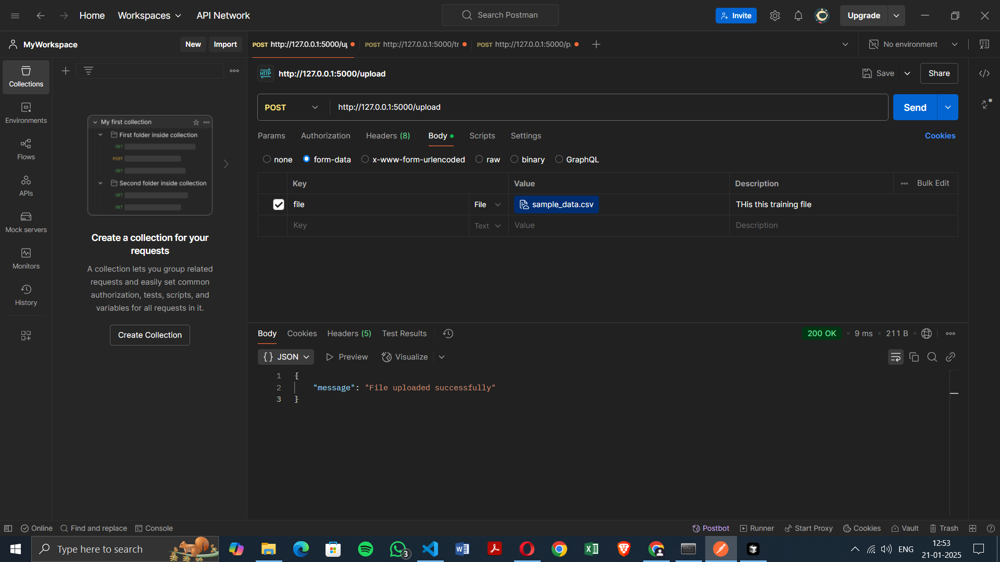
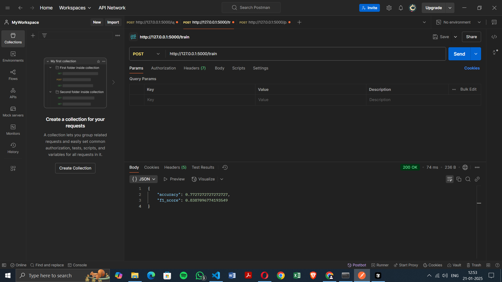
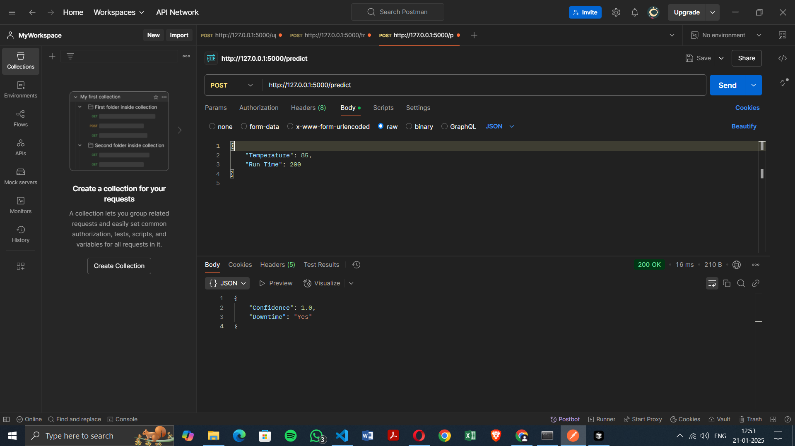

# MachineDowntime
# Predictive Analysis API

This project implements a RESTful API for predictive analysis in manufacturing operations.

## Flow

1. **Data Collection**: 
    - Gather data from various manufacturing systems, including sensors, logs, and manual inputs.
    - Ensure data is collected in a consistent format for ease of processing.

2. **Data Preprocessing**: 
    - Clean the collected data to remove any inconsistencies or errors.
    - Normalize and transform data to a suitable format for analysis.
    - Handle missing values and outliers appropriately.

3. **Model Training**: 
    - Use historical data to train predictive models.
    - Select appropriate machine learning algorithms based on the nature of the data and the prediction goals.
    - Validate and tune the models to ensure accuracy and reliability.

4. **Prediction**: 
    - Apply the trained model to new data to predict potential downtime.
    - Continuously update the model with new data to improve prediction accuracy over time.

5. **Reporting**: 
    - Generate detailed reports and visualizations to present the predictions and insights.
    - Provide actionable recommendations based on the analysis to minimize downtime.

6. **Integration**: 
    - Integrate the API with existing manufacturing systems to enable real-time data analysis and prediction.
    - Ensure seamless communication between the API and other systems for efficient data flow and utilization.

    ## API Endpoints

    ### POST /upload
    - **Description**: Upload manufacturing data in CSV format for analysis.
    - **Request Body**: CSV file containing data from sensors, logs, and manual inputs.
    - **Response**: Confirmation of CSV data upload and preprocessing status.

    

    ### POST /train
    - **Description**: Train the predictive model using historical data.
    - **Request Body**: JSON specifying training parameters and data sources.
    - **Response**: Status of the training process and model accuracy metrics.

    

    ### POST /predict
    - **Description**: Predict potential downtime using the trained model.
    - **Request Body**: JSON containing new data for prediction.
    - **Response**: Predicted downtime and confidence intervals.

    